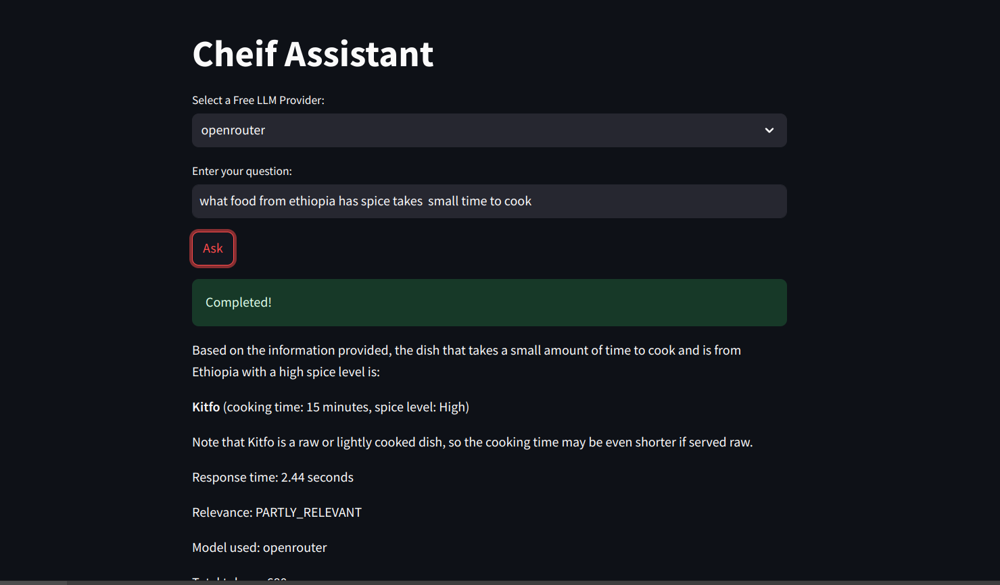
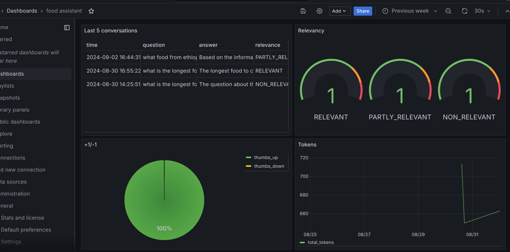

# ChefAssistAI


A cooking assistant that leverages Retrieval-Augmented Generation (RAG) to provide comprehensive cooking guidance.

## Overview

Navigating the culinary world can be daunting, especially for those new to cooking. Recipes often use unfamiliar terms, and finding trustworthy answers to specific food questions can be time-consuming.

ChefAssistAI serves as a virtual kitchen companion, utilizing cutting-edge AI to offer instant, reliable guidance on all things food-related. From ingredient substitutions to cooking techniques, this tool empowers both novices and seasoned chefs to explore the culinary arts with confidence.

### What ChefAssistAI Can Help With

ChefAssistAI is designed to assist with a wide range of culinary queries and tasks, including:

- Recipe information and cooking instructions
- Cuisine knowledge from various cultures
- Dietary information and meal planning
- Cooking techniques and equipment usage
- Ingredient substitutions and food pairings
- Spice levels and flavor profiles
- Serving suggestions and cultural context
- General cooking tips and tricks

Whether you're looking to try a new recipe, understand a cooking technique, or explore different cuisines, ChefAssistAI is your go-to culinary companion.

## Dataset

ChefAssistAI is powered by a comprehensive culinary dataset that includes:

- Detailed ingredient lists and cooking instructions
- Information on cooking techniques, equipment, and serving suggestions
- Cuisine classifications and cultural context for dishes
- Dietary information (e.g., vegetarian options, meal types)
- Spice level indicators and flavor profiles

The Dataset was generated using GPT-4 and is a collection of recipes, cooking techniques, ingredient information, and other culinary knowledge.


The project is built using:

- Streamlit for the user interface, allowing users to interact with the AI seamlessly
- Pinecone as the vector database (knowledge base) for storing and querying vector embeddings of the dataset
- Grafana for monitoring the performance and responses of the AI
- Grok and OpenRouter as the free LLMs for query handling, natural language understanding and response generation

## Features

- Natural Language Query Handling: Users can ask questions about food, recipes, ingredients, and more
- Streamlit UI: A user-friendly web interface for interacting with the AI
- RAG (Retrieval-Augmented Generation): Combines retrieval of relevant information from a dataset That was generated using GPT-4 
- Real-time Monitoring: Uses Grafana to monitor response times, user queries, and system performance. postgres database to store the conversations and feedback
- Efficient Data Storage and Retrieval: Pinecone vector database stores and retrieves data efficiently using vector embeddings

## Technology Stack

- Language Models: Grok, OpenRouter (Free versions)
- Frontend: Streamlit
- Vector Database: Pinecone
- Monitoring Tool: Grafana and Postgres
- Programming Language: Python
- Containerization: Docker and Docker Compose


## Getting Started

### General Structure

The project is organized into the following directories:

- `app`: The source code for the project along with the docker file and docker compose file
- `data`: The food dataset
- `notebooks`: The notebooks used for data processing and created pinecone index as well as testing llm providers


### Prerequisites

Ensure you have the following installed:

- Python 3.8 or higher
- Streamlit
- Docker
- Docker Compose
- Pinecone Client Library
- Grafana
- API keys for Pinecone, Grok and OpenRouter


### Installation

### clone the repo

```bash
git clone https://github.com/sam23121/ChefAssistAI.git
cd ChefAssistAI/app
```

### Install Required Packages

Install Python packages from the requirements.txt file.

```bash
pip install -r requirements.txt
```

### Set Up Pinecone, Grok, and OpenRouter

Create a Pinecone, Grok and OpenRouter account and obtain your API keys.

#### Set Up Environment Variables

Create a `.env` file in the root directory and add your API keys:

```bash
PINECONE_API_KEY=your-pinecone-api-key
PINECONE_ENVIRONMENT=your-pinecone-environment
GROK_API_KEY=your-grok-api-key
OPENROUTER_API_KEY=your-openrouter-api-key
```


#### Build and Run with Docker Compose

```bash
docker-compose up --build
```


This command will build the Docker images and start the containers for the Streamlit app, Grafana, and Postgres.

### Accessing the Application

- Streamlit App: Visit http://localhost:8501 in your browser. 

- Grafana Dashboard: Visit http://localhost:3000 in your browser. 


## Evaluations

### Retrieval evaluation

Using Only vector search gave the following metrics:

Hit rate: 88.8%
MRR: 11.2%

Using Hybrid search gave the following metrics:

Hit rate: 37%
MRR: 6.2%

Which shows that vector search is better for this use case. (Maybe it was poor because of my implementation)


### RAG flow evaluation

I used the LLM-as-a-Judge metric to evaluate the quality of our RAG flow. The llm used was from groq using llama3.1-70b-versatile

in a sample with 200 records, I had:

(81%) RELEVANT
(14.6%) PARTLY_RELEVANT
(0.4%) NON_RELEVANT


## Background

Below are the explanations for the key components in the project. This projects can be built with no credits and all llm providers are free.

### Docker and Docker Compose: A Detailed Explanation

Docker and Docker Compose are used in this project to containerize the application, making it easy to deploy and run consistently across different environments.


#### Key Components in Docker Compose

The `docker-compose.yml` file defines the following services:

1. `app`: The Streamlit application
2. `grafana`: The Grafana monitoring dashboard
3. `postgres`: The PostgreSQL database for storing conversation logs and metrics

#### How Docker Works in This Project

1. The Streamlit app, Grafana, and Postgres are each defined as separate services in the Docker Compose file.
2. When you run `docker-compose up`, it builds and starts all the containers.
3. The containers are networked together, allowing them to communicate with each other.
4. Volumes are used to persist data for Grafana and Postgres.
5. Environment variables are passed to the containers for configuration.

Using Docker and Docker Compose simplifies the deployment process and ensures that all components of the ChefAssistAI project work together seamlessly.


### 3 Pinecone: A Detailed Explanation

Pinecone is a fully managed vector database that makes it easy to work with vector embeddings. It's optimized for storing and querying large amounts of vector data, which is essential for applications like Chef Assistant AI that rely on retrieval-augmented generation.


#### How Pinecone Works in This Project

In the Chef Assistant AI project:

1. Pinecone stores vector embeddings of the food dataset.
2. When a user query is received, the query is converted into a vector embedding.
3. Pinecone retrieves the most relevant embeddings from the dataset based on the query vector.
4. The retrieved data is then passed to GPT-4 to generate a context-aware response.

## Contributing

We welcome contributions! Please read our Contributing Guide for details on how to contribute to the project.

## License

This project is licensed under the MIT License - see the LICENSE file for details.


